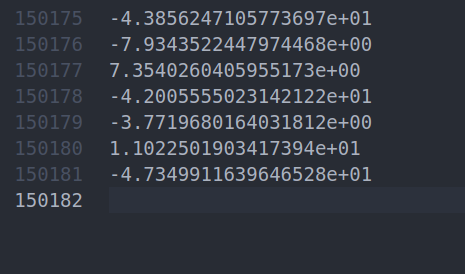

# 手写BA优化-仅基于Eigen-自行实现类似G2O框架

> Author: [weihaoysgs@gmail.com](weihaoysgs@gmail.com)

## BAL 数据集介绍

- 数据集格式
```xml
<num_cameras> <num_points> <num_observations>
<camera_index_1> <point_index_1> <x_1> <y_1>
<camera_index_1> <point_index_1> <x_1> <y_1>
...
<camera_index_num_observations> <point_index_num_observations> <x_num_observations> <y_num_observations>
<camera_index_num_observations> <point_index_num_observations> <x_num_observations> <y_num_observations>
<camera_index_num_observations> <point_index_num_observations> <x_num_observations> <y_num_observations>
...
<camera_1>
...
<camera_num_cameras>
<point_1>
...
<point_num_points>
```

- 这里<camera_1>表示第1个相机的参数，相机的参数共有9个，包括 $R,t,f,k1,k2$ 其中 $R$ 采用旋转向量 $(R \in SO(3)$表示，因此实际<camera_1>共占9行。
- 同样的<point_1>为3D点的坐标($P\in R^3$)，共占3行。

```xml
<相机数量> <3D点数量> <观测2D点数量>
<相机索引_1> <3D点索引_1> <观测2D点_x_1> <观测2D点_y_1>
...
<相机索引_1> <3D点索引_1> <观测2D点_x_1> <观测2D点_y_1>
<相机参数_1--1>
<相机参数_1--2>
...
<相机参数_1--8>
<相机参数_1--9>
...
...
<相机参数_n--1>
<相机参数_n--2>
...
<相机参数_n--8>
<相机参数_n--9>
<3D点_1_x>
<3D点_1_y>
<3D点_1_z>
...
<3D点_m_x>
<3D点_m_y>
<3D点_m_z>

```

- 本项目中的数据集如下所示（这里只放出了前三行）：

  ```shell
  16 22106 83718
  0 0     -3.859900e+02 3.871200e+02
  1 0     -3.844000e+01 4.921200e+02
  ```

  那么根据我们前面的理解该文件应该一共有 $16\times 9+22106\times 3 + 83718=150180$ 行。如下图所示这里多了一行是第一行的提示信息：

  

## Reference

- [数据集介绍](https://blog.csdn.net/ZDPZN/article/details/119885086)